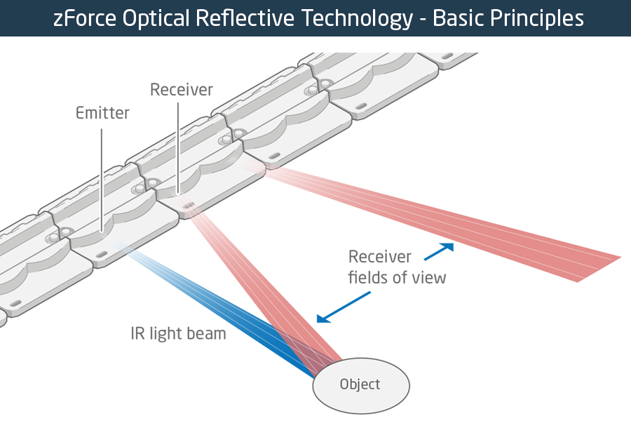

I have been a fan of e-Ink readers and i bought first e-Ink reader Nook Simple Touch (NST) in 2013 and very excited with the paper like display for reading purposes. Working with smart phones, tablets in the digital world has created a a sense of discomfort for our eyes. E-Ink readers comes to the rescue by aoiding those lights and bringing the immersive experience similar to book reading. I do read from physical books, but procuring, managing and maintaining them has become tough.  

​	Sometimes i do print some of the PDF books from a nearby book shop and read from them. In this post i woulk like to share some of my experiments with the Nook simple touch which is lying idle due to broken IR sensor and how i started using again as a wall display.

The NST is a 6-inch e-Ink Display with 800x600 dimension of 2GB Internal storage with support for external storage. Its' running a custom android (1.2.1). You can't install android apps as the fundamental purpose is just ro buy ebooks and read them. But still the community has created some workaround to root the device and customize further with support for android apps sideloading.

**NST Front Shell wornout :**

​	The NST e-INK Reader uses a modern methnology zForce Touchscreen which uses a IR Receiver and Emitter to sense the use TouchPoints. This is different from the approach used in todays smartphone using capacitive touch screen. The NST front and back panel is made up of Rubberized material and its light weight. It has 4 Buttons on the Left and Right. These are also used for the navigation purpose while reading to turn the pages left and right.

​	After using the NST for a year, i thought of using some solution to clean the dust and make them shine. I used the some edible  oil to wipe out the dust and make them new. But after few weeks, the front shell of the NST started getting bruises on the panel and wearing out. Looks like some chemical reaction happened after i cleansed with the oil. To manage the wornout i applied some paste to further avoid the furter damage. Unfortunately the paste went inside the green bezels of the NST screen and it broken the touch sensor.

**NST - Light Guide (Green Bezel) : Infrared Emitter and Receiver**

​	The zForce Touch screen from "neonode" use the the green acrylic bezel as the IR [light refractor](https://www.seminarsonly.com/computer%20science/zForce-Touch-Screen.php) through that the underlying PCB is able to detect the user touches. It even works well with multi touch. When the glue is applied on the front-panel bezels, the touch sensor was working well. After few hours, i left the NST to dry out and when i came back the touch sensor failed to work. When i investigated further the glue has entered inside the green light guide bezel and collapsed the light refraction alogorithm.

​	From then i was unable to use the NST as its is equivalent to a dead device. The device can response only after a human touch because it doesn't support USB keyboard or mouse.

​	But i had a lot of hope that i can revive this and tried various experiments to bring back to this to Life. The only hope is of ADB USB Tethering. Because the NST is running on Android 1.2.1 Version and adb is supported by rooting the NST and use them for Remote Display unit. I may not able use this device without replacing the Light Guide and it's tough to see anyone selling this spare parts anywhere. So, Using as the Remote display unit is the only choice to give back Life to this e-Ink display.

*Credits : zForce Reflective Technology.*




**Rooting the NST**

Even before the broken IR Light Guide, i already rooted the device using [NookManager](https://github.com/doozan/NookManager ) and installed custom launcher and apps. Even i installed the Dropbox App so that i can sync ebooks via dropbox. NookManager has installed few apps by default through which we can able to use the ADB shell to send commands like input, keyevent and touch co-ordinates. 

But i couldn't figure out how to do this and posted my [question](https://forum.xda-developers.com/nook-touch/general/nook-simple-touch-broken-ir-t3867968) to XDA Forum to figureout how to revive back the NST.  The XDA community is more active in providing help and support and i would like to thank [*Renate NST*](https://forum.xda-developers.com/member.php?u=4474482) for her detailed replies for my queries.

**Sending Input to NST via ADB Shell**

​	I have not worked much on the Android Platform. During this expploration i came to know how to use ADB commands to control the android device. Most of the articles on the internet are related to modern android OS and those commands may not work with the NST Android with 1.2.1 version. Example, tap, touch an swipe will not work as those are introduced only after Android 4.1+ versions.

Hre some of the ADB Shell commands

```bash
APP_ID=ElectricSignPrefs; adb pull /data/data/${APP_ID}/shared_prefs/${APP_ID}_preferences.xml /tmp/${APP_ID}_preferences.xml && vim /tmp/${APP_ID}_preferences.xml && adb push /tmp/${APP_ID}_preferences.xml /data/data/${APP_ID}/shared_prefs/
```

I used the following command to overwrite some configuration settings and push that file to the device, Android stores the user preferences settings to a file which resides in the folderpath /data/data/shred_prefs/(application cusom setting name).xml

```bash
# Upload a file to the device to a custom path
adb push /projects/freelancing/serverless-puppeteer-layers/shared_prefs/ElectricSignPrefs.xml  /data/data/com.sugoi.electricsign/shared_prefs/ElectricSignPrefs.xml  
```

```bash
# Open any app based on the Activity Intent
adb shell am start -n org.nookmods.ntmm/.MainActivity
```

```bash
# List the apps installed
adb shell 'pm list packages -f' | sed -e 's/.*=//' | sort
```

To kill the currently running app. 

```bash
am force-stop com.sugoi.electricsign/.ElectricSignActivity 
```

I also use ps | grep packagename to find the running process and kill based on the process Id.


To list all the available input options

```bash
/system/bin/input
usage: input ...
       input text <string>
       input keyevent <key code number or name>
# The following input commands will not be available on NST as it's running on old version of Android 1.2.1
input tap <x> <y>  
input swipe <x1> <y1> <x2> <y2>
```

**Sending a Touch Event.**

​	To simulate a touch event, it involves a series of commands which needs to be sent to the system by the sensor. Originally the ZForce touchscreen sensor takes care of generating the appropriate co-ordinates based on the calculations done using the IR Light Guide. In our case we need to generate these events to simulate the touches.

If i want to send a tocuh event at X:400 & Y:300, i need to use the following.

I used a bash script to run this at one shot. Remember, there should not be any delay between these commands otherwise the input will not be considered.


Here the /dev/input/event2 corresponds to zForce Touch screen input device.

```bash
#!/bin/bash
#Set the Co-ordinates to initiate the touch points
adb shell sendevent /dev/input/event2 3 0 430
adb shell sendevent /dev/input/event2 3 1 700
# Send the touch event based on the set co-ordinate
adb shell sendevent /dev/input/event2 1 330 1
adb shell sendevent /dev/input/event2 0 0 0
# Release the touch. (removing the finger event)
adb shell sendevent /dev/input/event2 1 330 0
adb shell sendevent /dev/input/event2 0 0 0

#Here some co-ordinates used to control the touches in the NookMod app and configure the buttons
#X,Y : 430, 700 - Customize the Top right Buton
#X,Y : 20, 175  - Go Back button from NookMod
#X,Y : 250, 150 - Select the default app to be open when the user clicks the top right button.


```


Finally, Mission accomplished to control the Nook simple touch without the touch screen. Please checkout my another article on how i converted this to a Wall display unit to display information. 
