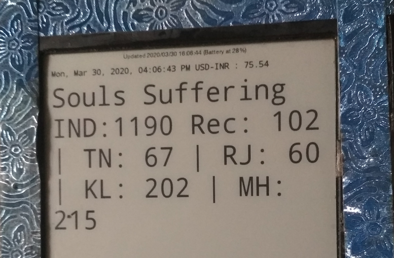

In this post i would like to share how i used my spare rooted Nook Simple Touch e-Ink reader as a Wall mounted display unit to show some live news and information. This was inspired by the post [Train Status Display](https://shkspr.mobi/blog/2020/02/turn-an-old-ereader-into-an-information-screen-nook-str/)




The objective is to create a daily dashboard screen with minimal information on a display. To get started with this i chose the following infromation to be shown

- Calendar Date Time 

- Currency Rate

- Corona Status Feed

- Daily Quotes 

  

### How this works

On the device, i have installed the ElectricSign App and configured them with the custom url. Based on the url content the app generates a image and saved in the screensaver path of android app and that is displayed in the screen.

**ElectricSign Android App to refresh display**

​	Electric sign app pulls the html page based on url and generates a png image and renders them to the screen based on configured settings like url, refresh intervals etc. Install  [ElectricSign](https://github.com/jfriesne/Electric-Sign) Android [apk](https://f-droid.org/en/packages/com.gacode.relaunchx/)

```bash
adb install com.gacode.relaunchx_200105000.apk
```

Please refer my other post on the workaround i used using adb to install and control old nook devices in which the screen is unresponsive.

**Live Data  using Google App Script**

Using Google Apps script is the best choice for these type of requirements as i don't need to host a specific server and easy to manipulate and update the codebase.

- Uses google apps script utilities to pull data from various api services

- Mash up the data and returns a html content

Apps script are not just for scripting, we can also use to serve html contennt to browser clients. The default method named "doGet" will be invoked when you access the url from browser clients. You can get the url when publishing the appscript as a web app.

```javascript
function doGet() {
  let dataPoints=getDisplayValues(); //Mash up method to collect live data from varios sources
  var t = HtmlService.createTemplateFromFile('index');
  t.data = dataPoints;
  var rst = t.evaluate();
  var html= rst.getContent();
  return ContentService.createTextOutput(html);
}
```

In the following section the getDisplayValues combines all the data points and returns as single json object.

```javascript
function getDisplayValues(){
 
  let dispValues={ 
    currency_rate:getCurrencyRate(),
    current_date:getDisplayDate(),
    active_ip_list:getActiveIPList(),
    daily_quotes:getDailyQuotes(),
    souls_suffering:getSufferList()    
  }
	return dispValues;
}
```


Here a sample snippet on  how i used the mash up of data from different services

```javascript

function getCurrencyRate(source="usd",target="inr"){
  
  const resourceUrl=`https://api.transferwise.com/v1/rates?source=${source}&target=${target}`;
  const options=  {
          headers: {Authorization: 'API TOKEN'},
          muteHttpExceptions : true
        }

    const response = UrlFetchApp.fetch(resourceUrl,options);
    const resp=JSON.parse(response.getContentText())

    return resp[0].rate;
}
```

Here the index.html template file in which the datapoints are injected.

````html
<!doctype html>
	<html>
	<head>
		<meta charset=utf-8>
		<style type='text/css'>
			table {
				border-collapse: collapse;
				width:100%;
			}

      td {
				font-family: monospace;
				font-size: 2.25em;
				padding: 5px;
			}
            
            .soul_stat{
                font-family: monospace;
				font-size: 1.25em;
            }
			th {
				font-family: monospace;
				font-size: 1.25em;
				padding: 5px;
			}
			th:nth-child(1),th:nth-child(2) {
				text-align: left;
			}
			th:nth-child(3),td:nth-child(3) {
				text-align: center;
			}
			th:nth-child(4),td:nth-child(4) {
				text-align: right;
			}
		</style>
	</head>
	<body>
			<table cellspacing="0">
				<thead>
					<tr>
						<th colspan='3'><?= data.current_date?> USD-INR : <?= data.currency_rate?></th>
					</tr> 
                  
				</thead>
				<tbody>
                  <tr>
						<td colspan='3' class="soul_stat">Souls Suffering IND:<?= data.souls_suffering.totalcases?> Rec: <?= data.souls_suffering.totalrecovered?> 
                        | TN: <?= data.souls_suffering.statecount[data.souls_suffering.statename.indexOf("TAMIL NADU")] ?> 
                        | RJ: <?= data.souls_suffering.statecount[data.souls_suffering.statename.indexOf("RAJASTHAN")] ?> 
                        | KL: <?= data.souls_suffering.statecount[data.souls_suffering.statename.indexOf("KERALA")] ?> 
                        | MH: <?= data.souls_suffering.statecount[data.souls_suffering.statename.indexOf("MAHARASHTRA")] ?></td>
					</tr>

				</tbody>
			</table>
		</html>
````


Hope you found useful and its not just for wall display. But you can use this even for creating a custom daily digest in google apps script and quickly access them from a bookmark.

