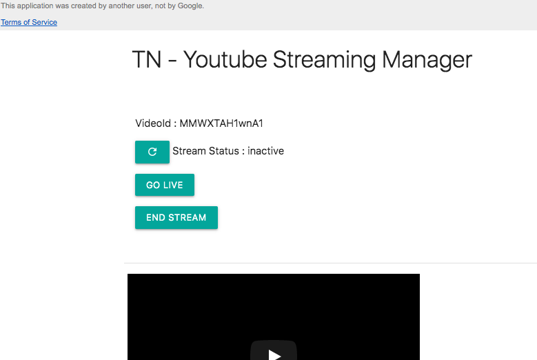

# Background & Motivation

Some of them may know that i have been a student/volunteer of a NGO and during this quarantine time it's hard to get together and meet the community. With that said, many of the social community also facing the same challenges and good that we have enough platforms now to meet online through hangouts, skype, zoom etc. Usually students from various branches gather daily in the nearby NGO centres to attend the classess and sessions in the morning at  7AM.  I have been suggesting the Youtube Live streaming to attend some of these workshops and sessions online and remain connected with the community.

We already have a Youtube channel which has around 9K subscribers and we have tried for couple of days using YoutubeLive Stream and it worked well and infact more than 100+ students participated in the community on a daily basis. In this post i would like to share how we setup this with minimal efforts and automate the setup using Google Apps Script.

### Livestream - Manual Setup

​	Since the session starts at 7 AM, I need to setup prior related to the StreamKey, Stream Title, Date, Category, Thumbnails and other settings in the Youtube Studio Portal. I was manually setting up everything either few hours before or the previous day. The good thing is the title and description will be almost similar for all days.

(e.g) Daily Workshop - <Dated> | <CityName>

Once the Title and Description are configured, i will ensure that the streamkey is properly updated in tehe OBS and the streaming shows active. (green icon)

### Tools  Used

- OBS Studio for Windows  - For Streaming to Youtube
- Teamviewer - To manage the Media Control Room PC Remotely (Audio/Mic)

We don't want someone to remain inside the Control Room for the entire session and thought of automating the process on daily basis. Let me show you how we automated some of the manual process involved.

### Livestream - Automatic Setup

Here the list of objective we wished to automate and minimize any human intervention on daily basis.

1. Start OBS Automatically at  7 AM
2. Start Streaming once the OBS was opened use an existing Default Stream Profile
3. Switch between the Desktop Audio & Line in Mic.
4. Schedule a Live Stream couple of hours before Automatically with visibility as Public.
5. Start the Livestream without worrying about the lot of options in the Youtube. Here i am talking about even someone without computer knowledge can start and stop the live stream
6. Monitor the Stream Status without logging to the Youtube Portal
7. Keep the StreamKey fixed Instead of auto-generation of new Stream Key in Youtube.

With the above objective, we decided to go with the Google Apps Script Platform to setup the schedule and live control. I have been watching out the YouTube API's from google and didn't get a oppurtunity to work in-depth in those API's. But now, with this realtime challenge, I preferred to play with the Youtube LiveStream API.

### Control Room PC - Desktop Automation

- Created a Windows Task Scheduler to Open the OBS daily at  7 AM
- Added a additional parameter to the exe arguments to automatically start the streaming as and when the OBS is opened.

```
C:\Program Files\<path to OBS>\obs.exe --startStreaming
```

If something is wrong either in audio or video, i use the Teamviewer to Login and fix them if needed like LineIn Mic settings or the background Audio which needs to be played during the session.

### Google App Script - Live Stream  Automation

Here the list of scripts which helps to automate

#### Live Stream Fundamentals

- Broadcasts : Any Live will start with a New Broadcast. Referenced by VideoId
- Videos :  Refers to Uploaded Videos or Live Completed Videos
- Streams : Any Streaming Client (OBS) can send the stream to the Youtube using the StreamKey. Referenced by StreamId
- Broadcast Status :  Testing, Live , Completed

A Live Broadcast has some of the following steps which happens in the background. The same thing we need to achieve using the Youtube API.

- Create a Broadcast and get the videoId of the Broadcast
- Update the Category, Made for Kids and Other Properties
- Create a Stream (If not exists already. You can use an existing as well.). We will use a fixed stream key and use them for all live streams so that we don't ned to update the OBS daily.
- Bind the Broadcast VideoId to the Stream using the StreamId
- Start the Broadcast Live by Updating the Broadcast status to Live
- End the Broadcast by Updating the Broadcast status to Completed.

Once the API's are ready, now, it's time to setup the simple UI through which we can Start/Stop the Live Session with the Click of a Button even from a Android Phone.

The following API assumes that you already added the Youtube Library using the Resource Libraries options in the Google Apps Script.


> *Schedule Live Event*
>
> ```javascript
> const streamId='<Get your stream Id>'
>
> fuction scheduleEvent(){
>     var actualString = Utilities.formatDate(
>       row.actual_date,
>       Session.getScriptTimeZone(),
>       "YYYY-MM-dd'T'HH:mm:ssZZZZZ"
>     );
>
>     actualString = actualString.replace('00:00:00+0530', '01:40:00.000Z');
>     row.start_time = actualString;
>     var broadcast_resource = create_broadcast(row);
>     var stream_resource = getStreamInfo(streamId);
>     var bind_result = bind_broadcast(broadcast_resource.id, stream_resource.id);
>     var videoId = broadcast_resource.id;
>     return videoId;
> }
> ```


> *Get the Re-usable Stream Info*
>
> ```javascript
> function getStreamInfo(streamId){
>   //var streamId="<your-fixed-stream-id>";
>   YouTube.setTokenService(function(){ return getYouTubeService().getAccessToken(); });
>   var resp=YouTube.liveStreamsList("snippet,cdn", {id:streamId});
>   return stream_resources[0];
> }
> ```


> *Update the Broadcast Category and MadeForKids flag and also the Video Thumbnails.*
>
> ```javascript
> function updateBroadcastMeta(videoId){
>   var resp=YouTube.videosList("snippet,status",{id:videoId});
>   resp[0].snippet["categoryId"]=27;
>   //It's mandatory to declare whether the video is made for the kids or not.
>   resp[0].status["madeForKids"]=false;
>   resp[0].status["selfDeclaredMadeForKids"]=false;
>   YouTube.videosUpdate("snippet,status",{id:videoId,snippet:resp[0].snippet,status:resp[0].status}, {});
>
> }
>
> function updateThumbnails(videoId){
>   YouTube.setTokenService(function(){ return getYouTubeService().getAccessToken(); });
>   var banner = "https://<domain-url>/annanagar/banners/murli-bg.png"
>   var logoBlob = UrlFetchApp.fetch(banner).getBlob();
>
>   var options={};
>   options.method="POST";
>   options.contentType='image/png';
>   options.payload=logoBlob;
>
>   YouTube.thumbnailsSet(videoId,options);
>
> }
> ```


> *Broadcast Creation and Binding the Broadcast to a Stream*
>
> ```javascript
> function create_broadcast(options) {
>   var insert_broadcast_response = YouTube.liveBroadcastsInsert(
>     'snippet,status',
>     {
>       snippet: {
>         title: options.title,
>         description: options.desc,
>         scheduledStartTime: options.start_time
>
>       },
>
>       status: {
>         privacyStatus: options.privacy_status,
>       },
>     },
>     {}
>   );
>
>   return insert_broadcast_response;
> }
>
>
> ```
>
>

> *Bind the Broadcast to Stream*
>
> ```javascript
> function bind_broadcast(broadcast_id, stream_id){
>   const bind_broadcast_response = YouTube.liveBroadcastsBind(broadcast_id,"id,contentDetails", {"streamId":stream_id});
>   return bind_broadcast_response;
> }
> ```
>
>

​    *Start  & End the Live (Go Live & End Stream)*

> ```javascript
> function updateTransition(transitionState){
>   YouTube.setTokenService(function(){ return getYouTubeService().getAccessToken(); });
>   var resp=YouTube.liveBroadcastsList("snippet,status", {id:videoId});
>   return YouTube.liveBroadcastsTransition(transitionState, videoId, "status", {});
> }
>
> function startLive(videoId){
>   const transitionState="live";
>  	updateTransition(transitionState);
> }
>
> function endLive(videoId){
>   const transitionState="completed";
>  	updateTransition(transitionState);
> }
> ```
>
>


If you are not aware of the fixed StreamKey stream Id, then you can use this to find out the StreamId.

>*Get StreamId for a given fixed stream key*
>
>```javascript
>var resp=YouTube.liveStreamsList("status,cdn", {mine:true});
>
>  var stream_resource=resp.filter(function(vItem){
>    return vItem.cdn.ingestionInfo.streamName=="<YourStreamKey>";
>  });
>
>  Logger.log(stream_resource[0].id) // This returns the streamId
>```
>
>


### Simple UI Live Control Page

The initial idea is not just automate the live stream creation but also provide a simple interface even for someone who has no much knowledge on streaming should able to start and end the live stream without much hassle. With the above API's functions in place we can create a simple html page through we can control the Live Stream or even Monitor the Stream status remotely.




> Html Page UI
>
> ```html
> <!DOCTYPE html>
> <html lang="en">
>
> <head>
>     <meta charset="UTF-8">
>     <meta name="viewport" content="width=device-width, initial-scale=1.0">
>     <meta http-equiv="X-UA-Compatible" content="ie=edge">
>     <title>Youtue Stream Manager</title>
>     <link rel="stylesheet" href="https://cdnjs.cloudflare.com/ajax/libs/materialize/1.0.0/css/materialize.min.css">
>     <script src="https://cdnjs.cloudflare.com/ajax/libs/jquery/3.4.0/jquery.min.js"></script>
>     <script src="https://cdnjs.cloudflare.com/ajax/libs/materialize/1.0.0/js/materialize.min.js"></script>
>       <link href="https://fonts.googleapis.com/icon?family=Material+Icons" rel="stylesheet">
>
>     <script>
>         function initEvents(){
>          $("#btnRefresh").click(()=>{
>
>              google.script.run.withSuccessHandler(function(resp) {
>                $("#streamStatus").html(resp.streamStatus);
>
>             }).getVideoStreamStatus();
>           });
>
>            $("#btnLive").click(()=>{
>
>          google.script.run.withSuccessHandler(function(text) {
>                 M.toast({
>                     html: text
>                 });
>
>             }).startLiveStream('<?= data.videoId?>');
>
>          });
>
>
>           $("#btnEndLive").click(()=>{
>              google.script.run.withSuccessHandler(function(text) {
>                 M.toast({
>                     html: text
>                 });
>
>             }).endLiveStream('<?= data.videoId?>');
>
>           });
>
>         }
>
>         $(document).ready(function() {
>            initEvents();
>         });
>
>     </script>
> </head>
>
> <body>
>     <div class="container">
>         <div class="row">
>             <div class="col s12">
>                 <h4 class="light"> TN - Youtube Streaming Manager </h4>
>             </div>
>
>         </div>
>
>         <div   id="itemList">
>             <div class="row highlight striped responsive-table">
>               <table>
>                  <tr>
>               <td>
>
>
>                 <div class="row">
>
>                 <div class="col s12">
>                 <p>VideoId : <?= data.videoId?></p>
>                 <p><button class="waves-effect waves-light btn-small"   id="btnRefresh" type="button"><i class="material-icons">refresh</i></button> Stream Status : <span id="streamStatus"><?= data.streamStatus?></span>   </p>
>                  <button class="btn-small btn" type="button" id="btnLive">Go Live</button>
>                     <p><button class="btn-small btn" type="button" id="btnEndLive">End Stream</button>
>                     </p>
>
>
>
>
>                 </div>
>             </div>
>               </td>
>               </tr>
>               <tr><td>
>
>               <iframe width="424" height="240" src="https://www.youtube.com/embed/<?= data.videoId?>" frameborder="0" allow="accelerometer; autoplay; encrypted-media; gyroscope; picture-in-picture" allowfullscreen></iframe>
>               </td>
>               </tr>
>
>                <tr>
>                       <td colspan="4">Copyrights @2020.  Tamilnadu</td>
>                         </tr>
>               </table>
>             </div>
>
>         </div>
>
>
>     </div>
> </body>
>
> </html>
>
> ```
>
>

> *Page Published as Web App with the default doGet method*
>
> ```javascript
> function doGet(e) {
>
>   const videoId=e.parameter.videoId;
>   const fileName="live-ctrl";
>   const streamInfo=getVideoStreamStatus();
>
>   var tplInfo=HtmlService
>   .createTemplateFromFile(fileName);
>   tplInfo.data={videoId:videoId,streamStatus:streamInfo.streamStatus};
>   var html =
>   tplInfo.evaluate()
>   .getContent();
>
>   return HtmlService
>      .createTemplate(html +
>                      "<script> var defaultArgs={videoId:'" + videoId + "'}; </script>")
>         .evaluate();
>
> }
>
> ```
>
>


### Final Integration

>The function processDailyLiveStream() is invoked by the Google App Scripts InBuilt Triggers daily at 5:30 AM (few hours before the session) and all the subscribers to that Youtube channel will be notified as the Stream Privacy status is Public.
>
>```javascript
>
>function notifyBroadcastStatus(videoId) {
>  var email = '<mailId>';
>  var subject = 'Live Broadcast Automation';
>  var body = '';
>  body =
>    body +
>    "<p>Dashboard : <a href='https://studio.youtube.com/channel/UCYfMGhyXN9laRF2CgDlrOMQ/livestreaming/dashboard?v=" +
>    videoId +
>    "'>Open Dashboard - " +
>    videoId +
>    '</a></p>';
>  body =
>    body +
>    "<p>Control Room : <a href='https://script.google.com/macros/s/AKfycbys9UE6iE64589fcagBHhZY8H_Xfq1oijxyRquEY2nQxlkgKwNo/exec?videoId=" +
>    videoId +
>    "'>Open Control Page</a></p>";
>
>  if (MailApp.getRemainingDailyQuota() > 0)
>    GmailApp.sendEmail(email, subject, body, {
>      htmlBody: body,
>    });
>}
>
>function processDailyLiveStream() {
>  //if(!dayCount)
>  var dayCount = 0;
>  var runDate = new Date().addDays(dayCount);
>  createLiveVideo(runDate);
>}
>
>function updateShortLinks(videoId) {
>  //Any external service like bit url to be updated
>  var url = '';
>  var response = UrlFetchApp.fetch(url);
>  if (response.getResponseCode() != 200) {
>    throw new Error(response.getContentText());
>  } else {
>    Logger.log(response.getContentText());
>    return response.getContentText();
>  }
>}
>
>function createLiveStream(runDate) {
>  var ss = SpreadsheetApp.getActiveSpreadsheet();
>  var sheet = ss.getSheetByName('Stream-Schedules');
>
>  var currentDateString = Utilities.formatDate(
>    runDate,
>    Session.getScriptTimeZone(),
>    'dd MMM YYYY'
>  );
>  var currentDate = Utilities.formatDate(
>    runDate,
>    Session.getScriptTimeZone(),
>    'YYYY-MM-dd'
>  );
>
>  var streamInfo = {
>    title: 'Workshop (Audio) - ' + currentDateString + ' from , Chennai',
>    streamDate: currentDateString,
>    privacyStatus: 'public',
>    format: '720p',
>  };
>  var rowData = [
>    [
>      streamInfo.streamDate,
>      streamInfo.title,
>      streamInfo.privacyStatus,
>      streamInfo.format,
>    ],
>  ];
>  sheet
>    .getRange(sheet.getLastRow() + 1, 1, rowData.length, rowData[0].length)
>    .setValues(rowData);
>
>  var videoId = createBroadcast();
>  updateThumbnails(videoId);
>  updateBroadcastMeta(videoId);
>  notifyBroadcastStatus(videoId);
>  updateShortLinks(videoId);
>}
>
>```
>
>


Now we have automated the creation and separated the start and end live in a separate UI so that even someone who is not aware of youtube streams or any volunteers from the NGO now can able to control provided they have enough access to the UI Page.

**Credits**

- Some of the scripts i used from this [article](https://mashe.hawksey.info/2017/09/identity-crisis-using-the-youtube-api-with-google-apps-script-and-scheduling-live-broadcasts-from-google-sheets/).
- [Youtube Library API](https://script.google.com/macros/library/versions/d/13FP5EWK7x2DASsiBXETcr0TQ07OCLEVWOoY1jbVR-bqVpFmsydUSXWdR)

### Tip
- If you want to see what the Library contains you can view the contents using the following Link https://script.google.com/d/13FP5EWK7x2DASsiBXETcr0TQ07OCLEVWOoY1jbVR-bqVpFmsydUSXWdR/edit?usp=drive_web

Hope you enjoyed this article on how we can leverage the YouTube API's to automate the live streaming for regular or recurring events. Please reach out me on twitter for any queries or clarifications.

